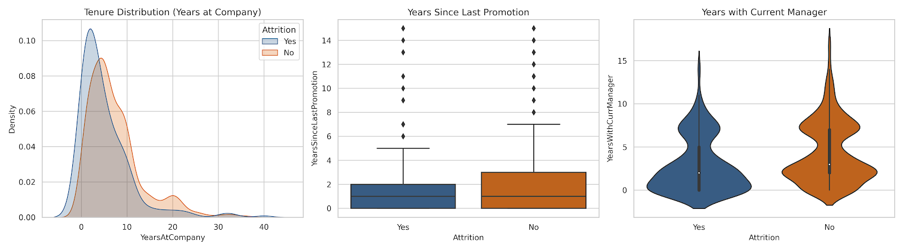
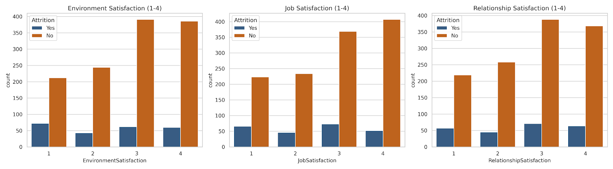
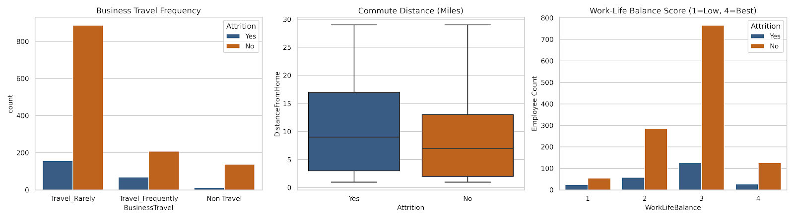
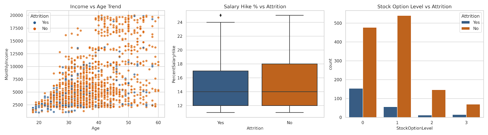
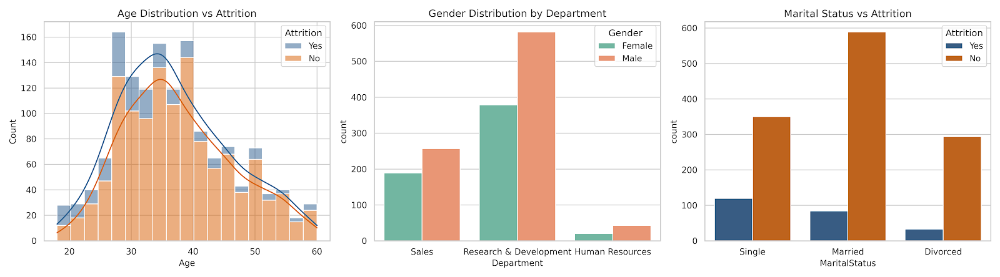

# 📊 HR Employee Attrition Analytics Dashboard


An end-to-end data analytics dashboard exploring the underlying socioeconomic, demographic, and behavioral drivers behind employee turnover. Built using Python, Pandas, Seaborn, and Matplotlib, this project turns raw HR metrics into five highly specialized executive insights dashboards.

---

## 🎯 Project Overview & Executive Summary

Employee attrition impacts organizational stability, knowledge retention, and onboarding costs. This project cleans and analyzes a workforce dataset containing **1,470 employees** across 35 multi-modal variables to pinpoint exact organizational friction points.

### 🔑 High-Level Organization KPIs
* **Total Workforce:** 1,470 Employees
* **Active Workforce:** 1,233 Employees
* **Total Departures (Attrition Count):** 237 Employees
* **Baseline Attrition Rate:** 16.1%
* **Average Monthly Income:** $6,502.93
* **Average Workforce Age:** 36.9 Years

---

## 📈 The 5 Analytics Dashboards & Insights

The analytical pipeline generates five distinct, multi-plot dashboards, each focusing on a specific thematic category influencing retention:

### 1. Demographics & Diversity Insights
* **Focus:** How age, relationship status, and gender distribution correspond to corporate stability.
* **Key Finding:** Attrition heavily spikes within the younger age bracket (**28–32 years old**). Furthermore, **Single** employees exhibit an elevated attrition rate of **25.5%**—significantly higher than married or divorced peers.
* 

### 2. Compensation & Financial Drivers
* **Focus:** The relationship between monthly income curves, stock equity incentives, and annual salary hikes.
* **Key Finding:** Base pay floor constraints ($2,000–$5,000 monthly) see high turnover regardless of age. Crucially, providing equity acts as an anchor: employees with **0 stock options** face a **24.4% attrition rate**, which immediately drops below 10% when level 1 equity is introduced.
* 

### 3. Work-Life Balance & Burnout Factors
* **Focus:** Physical stressors including business travel frequency, daily commute distances, and subjective work-life scores.
* **Key Finding:** Burnout is a primary attrition catalyst. Employees required to **Travel Frequently** show a **24.9% attrition rate**. Long commutes also exhibit a direct positive correlation with voluntary employee departures.
* 

### 4. Workplace Satisfaction & Culture Metrics
* **Focus:** Quantifying psychological indicators like physical environment comfort, career job satisfaction, and relationship dynamics.
* **Key Finding:** The impact of job enjoyment is massive. Employees rating `JobSatisfaction` as Level 1 (Low) exit at a **22.8% rate**, whereas Level 4 (Very High) employees exit at only **11.3%**.
* 

### 5. Career Growth & Tenure Patterns
* **Focus:** Tracking time-based milestones like promotion cycles, general tenure, and reporting structure alignment.
* **Key Finding:** The **"Two-Year Hazard Zone"** is highly apparent; the highest density of employee exits occurs between years 1 and 2 at the company. There is also a distinct attrition spike during the first year of transitioning to a **new manager**.
* 

---

## 🛠️ Tech Stack & Dependencies

* **Language:** Python 3.8+
* **Data Manipulation:** `pandas`, `numpy`
* **Data Visualization:** `matplotlib`, `seaborn`

To set up the workspace and replicate the dashboard generations, install the required libraries:

```bash
pip install pandas numpy matplotlib seaborn
